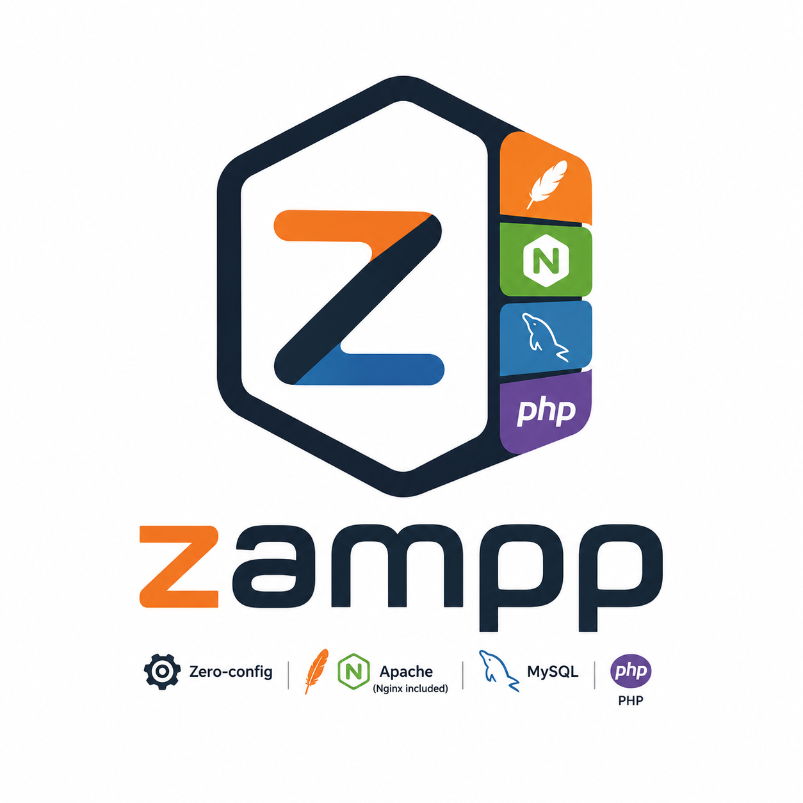
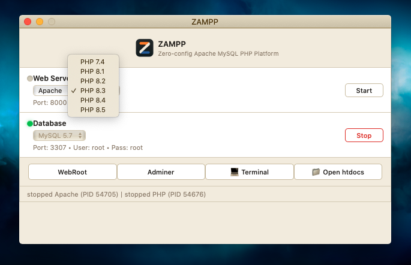

<p align="center">
  
</p>

<h1 align="center">ZAMPP for Windows</h1>
<p align="center">
  
  
</p>

<p align="center">Zero-config Apache MySQL PHP Platform (Windows Edition)</p>

ZAMPP for Windows adalah aplikasi desktop native yang berfungsi sebagai Lingkungan Pengembangan Web Lokal (*Local Web Development Environment*). Ini merupakan hasil porting khusus untuk sistem operasi Windows, dirancang agar jauh lebih ringan, cepat, dan sepenuhnya *Zero-Configuration* dibandingkan alternatif seperti XAMPP atau WampServer.

Konfigurasi port default telah disesuaikan secara khusus agar tidak bentrok (*conflict-free*) dan sangat bersahabat saat berjalan berdampingan dengan lingkungan WSL (Windows Subsystem for Linux), Docker, maupun service database lokal lainnya.

## Key Features
- **Zero-config:** Cukup klik "Start" dan mulai coding tanpa perlu repot konfigurasi file manual.
- **Native Windows Integration:** Dibangun dengan Golang dan Wails, menggunakan native Windows process management, File Explorer, dan PowerShell terminal session.
- **WSL & Docker Friendly Ports:** Konfigurasi port default diatur pada range port 9000 & 3309 agar terhindar dari konflik port standar (seperti port 80, 8080, 8000, 3306).
- **Modular Architecture:** Installer utama berukuran sangat ringkas. Versi PHP tambahan (7.4 - 8.5) dapat diunduh langsung dari aplikasi sesuai kebutuhan (*On-Demand Download*).
- **Multi PHP Version:** Mendukung perpindahan versi PHP secara instan.
- **Fast Startup:** Engine Nginx/Apache, MySQL, dan PHP berjalan independen di background dengan performa maksimal.
- **Smart PowerShell Terminal:** Membuka sesi PowerShell baru dengan `$env:Path` PHP aktif dan alias fungsi `composer` yang langsung siap digunakan di direktori `htdocs`.

---

## Screenshot

<p align="center">
  
</p>

---

## Directory Structure (htdocs)

Semua file proyek website (HTML/PHP/WordPress) diletakkan di dalam folder *Document Root*. Anda dapat membuka direktori ini secara langsung dengan mengklik tombol **"📁 Open htdocs"** di aplikasi ZAMPP, atau mengaksesnya di:

```
C:\Users\<username>\.zampp\
  ├── bin\        binaries (php, mysql, nginx, apache)
  ├── conf\       generated configs (nginx.conf, httpd.conf)
  ├── data\mysql\ MySQL data + socket
  ├── logs\       per-engine logs
  └── htdocs\     document root
```

---

## Ports & Defaults

| Service | Port | Deskripsi |
| :--- | :--- | :--- |
| **Web Server** | `9000` | Nginx atau Apache (dapat dipilih via dropdown) |
| **PHP FastCGI (internal)** | `9001` | Diproyeksikan melalui Web Server aktif |
| **MySQL Database** | `3309` | Menghindari bentrok dengan default MySQL (3306) & WSL/Docker |

---

## First-Run Engine Bundle & Modular PHP

Saat pertama kali dijalankan, ZAMPP akan mengunduh bundel engine dasar untuk Windows dari GitHub Releases dan mengekstraknya ke direktori `%USERPROFILE%\.zampp`:

```
https://github.com/semutdev/zampp/releases/download/v1.0.0/zampp-win-x64-v1.zip
```

Versi PHP tambahan bersifat modular dan diunduh on-demand saat versi dipilih:

```
https://github.com/semutdev/zampp/releases/download/v1.0.0/php-{version}-win.zip
```

Progress pengunduhan dilaporkan ke frontend secara real-time melalui event:
- `download-progress` / `php-download-progress` (0–100%)
- `download-complete` / `php-download-complete`

---

## Live Development

Untuk menjalankan aplikasi dalam mode live development:

```bash
wails dev
```

Untuk melakukan build installer aplikasi produksi:

```bash
wails build
```

---

<p align="center">
  Built with ❤️ by <a href="https://semut.dev">semut.dev</a>
</p>
